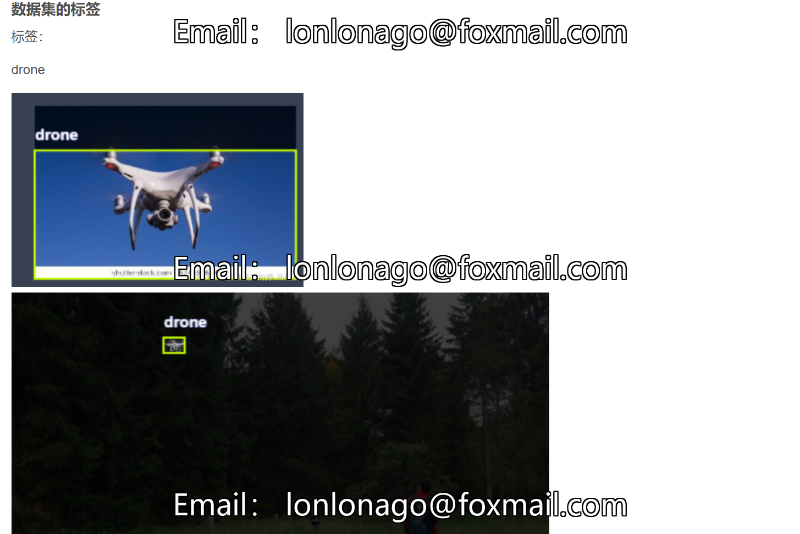

# 10,000 Original Drone Images, Drone Dataset, Labeled with YOLO V5 Format, Accurate Recognition Rate Can Reach 95.7%

732.83MBZIP
Drone Dataset, Supports YOLO, COCO JSON, PASICAL VOC XML Format for Annotations, Accurate Recognition Rate Can Reach 95.7%, 10,000 Original Images
The drone dataset plays a crucial role in the research and application of drone technology.
By analyzing and processing the drone dataset, issues such as the flight characteristics, perception capabilities, and navigation control algorithms of drones can be studied to enhance their 
performance and reliability.
Furthermore, the drone dataset can also be used to train machine learning and deep learning models for applications such as drone target detection, tracking, map construction, etc.

## Images

Here is a pay link on Stripe ( https://buy.stripe.com/3cs8yP7sY87d0vu9AB ). Please contact me lonlonago@foxmail.com after funding $89, and I will send you a complete data files , thank you!

